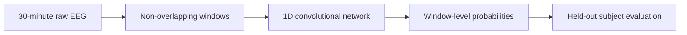

# MCI Classification from Raw EEG with 1D CNNs

This repository contains the research code and supporting documents for a bachelor's
project on classifying mild cognitive impairment (MCI) from resting-state
electroencephalography (EEG).

The central question is deliberately practical: **can compact neural networks learn
useful MCI patterns directly from raw EEG, without handcrafted features, denoising, or
time-frequency representations?** The project evaluates four temporal resolutions and
then tests every electrode independently to study how much discriminative information
is retained in a single EEG channel.

The implementation uses one-dimensional convolutional neural networks and preserves
subject independence through leave-one-subject-out evaluation. It is a research
prototype, not a clinical diagnostic system.

## Research contributions

- An end-to-end raw-EEG classification pipeline requiring only segmentation into
  non-overlapping windows.
- Four purpose-built CNN variants for 2.5, 5, 7.5, and 10-second EEG windows.
- Subject-wise evaluation across 60 participants rather than randomly mixing windows
  from the same participant across train and test sets.
- A 19-model single-channel study designed to estimate the contribution of each EEG
  electrode to MCI versus healthy-control classification.
- A cleaned, current-Keras implementation that retains the original architectures.

## Dataset

The project subset contains 60 participants:

- 29 participants diagnosed with MCI
- 31 cognitively healthy controls
- All participants older than 55
- Resting-state, eyes-closed EEG
- 19 electrodes placed according to the international 10-20 system
- 30 minutes per participant at 256 Hz

The electrodes are `Fp1`, `Fp2`, `F7`, `F3`, `Fz`, `F4`, `F8`, `T3`, `C3`, `Cz`,
`C4`, `T4`, `T5`, `P3`, `Pz`, `P4`, `T6`, `O1`, and `O2`.

The dataset originates from the study by Kashefpoor, Rabbani, and Barekatain:

> M. Kashefpoor, H. Rabbani, and M. Barekatain, “Supervised dictionary learning of
> EEG signals for mild cognitive impairment diagnosis,” *Biomedical Signal Processing
> and Control*, vol. 53, 101559, 2019.
> [https://doi.org/10.1016/j.bspc.2019.101559](https://doi.org/10.1016/j.bspc.2019.101559)

Raw EEG data is not committed to this repository. See [`data/README.md`](data/README.md)
for the expected archive names, extracted files, and array shapes.

## Model architectures

Each convolutional block follows the original sequence:

`Conv1D -> ReLU -> Dropout(0.2) -> BatchNormalization -> MaxPool1D`

The convolutional stack is followed by `Flatten`, a 100-unit ReLU dense layer, and a
single sigmoid output. All-channel models begin with layer normalization; the original
single-channel model does not.

| Window | Convolution kernels | Filters |
| --- | --- | --- |
| 2.5 seconds | 7, 13, 19 | 16, 32, 64 |
| 5 seconds | 9, 13, 17, 21, 23 | 16, 32, 64, 32, 32 |
| 7.5 seconds | 11, 15, 19, 23, 27 | 16, 32, 64, 32, 32 |
| 10 seconds | 11, 15, 19, 23, 27 | 16, 32, 64, 32, 32 |

The notebook's default active experiment is the original 2.5-second, all-channel
variant. The other original definitions remain in the architecture cell for manual
selection, matching the source project workflow.

## Historical project results

The final, unpublished manuscript associated with the thesis reported the following
results under the **original** evaluation procedure:

| Experiment | Reported result |
| --- | ---: |
| Best all-channel accuracy, 7.5-second windows | 95.58% |
| Best all-channel sensitivity, 10-second windows | 99.10% |
| Best single channel, C3 | 85.97% accuracy |
| T3 single channel | 84.24% accuracy |
| T5 single channel | 81.87% accuracy |

These values are included as historical project context, not as newly reproduced
benchmarks. The original notebook used the held-out test subject for early-stopping
model selection. The cleaned notebook removes that leakage by deriving validation data
only from the training set. Consequently, a complete rerun may produce different—and
more defensible—performance estimates.

## Repository contents

- [`MCI_EEG_Conv1D.ipynb`](MCI_EEG_Conv1D.ipynb) — Colab notebook for loading,
  segmentation, training, model persistence, and evaluation.
- [`docs/thesis-fa.pdf`](docs/thesis-fa.pdf) — final thesis in Persian.
- [`docs/presentation-fa.pdf`](docs/presentation-fa.pdf) — final presentation in
  Persian.
- [`data/README.md`](data/README.md) — dataset layout and expected shapes.
- [`requirements.txt`](requirements.txt) — Python dependencies for a local runtime.

Datasets, trained models, editable drafts, and clinical source files are intentionally
excluded.

## Running in Google Colab

1. Place the two dataset archives in `My Drive/Bachelor's Project/` using the exact
   filenames documented in [`data/README.md`](data/README.md).
2. Open [`MCI_EEG_Conv1D.ipynb`](MCI_EEG_Conv1D.ipynb) in Google Colab.
3. Enable a GPU runtime if available.
4. Review `c`, `t_batch`, and the corresponding active architecture before training.
5. Run the notebook from top to bottom.

The default experiment performs 60 training folds and may take substantial time. New
models are stored in the current `.keras` format. If you select another time-window or
single-channel architecture, update the model output directory consistently before
starting the run.

## Validation status

Repository preparation included the following checks:

- Notebook structure and syntax validation
- Preprocessing tests against the original EEG arrays
- Verification of subject counts, labels, and generated window shapes
- Byte-for-byte confirmation that the original architecture cell was retained
- A TensorFlow 2.21 and Keras 3.15 runtime smoke test covering model construction,
  one training epoch, prediction on real EEG windows, evaluation, and `.keras`
  save/reload consistency

The complete 60-fold experiment has not been rerun after correcting the evaluation
procedure.

## Responsible use

This repository is intended for research and education. It does not provide a medical
diagnosis and has not been validated for clinical deployment. Any clinical use would
require independent external validation, prospective testing, appropriate regulatory
review, and assessment across more diverse populations and recording conditions.

